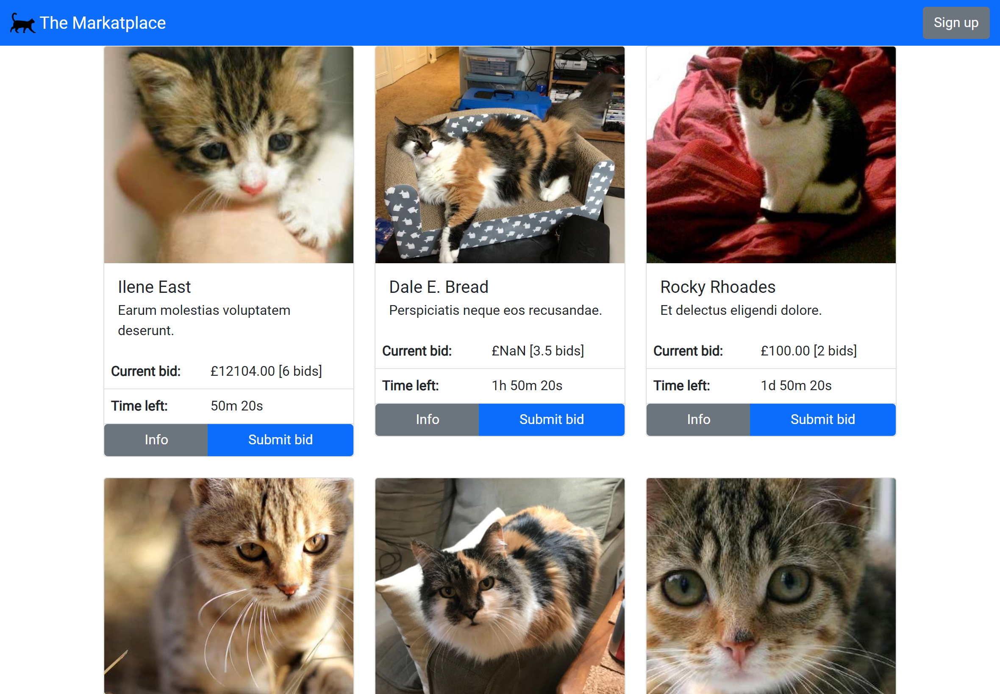
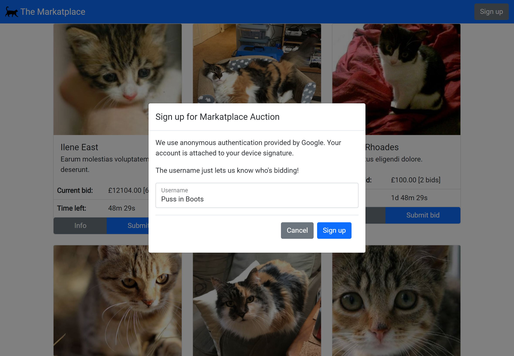

# Auction Website

In this repo you will find the code and instructions to host an auction website for free using GitHub Pages and Firebase anonymous authentication & databases.

This is a project I originally worked on for a charity event and I've been improving it in my spare time ever since. Contributions and suggestions are welcome!

## Table of contents
- [Table of contents](#table-of-contents)
- [Functionality](#functionality)
- [Setup](#setup)
  - [Adding auction information](#adding-auction-information)
  - [Firebase setup](#firebase-setup)
    - [Creating a project](#creating-a-project)
    - [Authentication](#authentication)
    - [Database](#database)
  - [Creating an admin account and initialising your auctions](#creating-an-admin-account-and-initialising-your-auctions)

## Functionality

- Device based login requiring only a username to be provided (no need to store sensitive information).
- Popups for more detailed descriptions and additional imagery.
- Realtime bidding using event listeners (no need to refresh page).
- Built with Bootstrap so everything is reactive.
- Has a separate page for administrators to monitor the auction.


|  |  |
|:---:|:---:|
|  |  |
|  |  |

## Setup
Here we will cover how to add your own information to the auctions themselves, then how to most a local server to see your changes and finally how to connect it all to Firebase to enable user login and bidding.

### Adding auction information
First, set `isDemo=False` in `js/items.js` (this will keep the cats at bay).

Then, populate the `Object` in `js/items.js` with the information for of the items you'll be putting up for auction. The fields are:
- `primaryImage` (`String`): path or URL to the primary image
- `title` (`String`): item title
- `subtitle` (`String`): item subtitle
- `detail` (`String`): item detail text
- `secondaryImage` (`String`): path or URL to the secondary image
- `currency` (`String`): the currency symbol to use
- `amount` (`Number`): item starting price,
- `endTime` (`string`): item end time in [ISO 8601 format](https://tc39.es/ecma262/#sec-date-time-string-format) (`YYYY-MM-DDTHH:mm:ss.sssZ`)

### Firebase setup
Here we will cover how to set up your Firebase project and then how to enable the Firebase authentication and database respectively.

#### Creating a project
You can create a project using the following steps:
- Head to the [Firebase console](https://console.firebase.google.com/) where you can manage your projects.
- Click `Add project` and name your project.
- Then you may enable or disable Google Analytics at your discretion.
- You will then be taken to your project's overview where you will add a web app to your project by clicking `Add app` and selecting the web app icon (the app's name is arbitrary and is only used to identify the app within your project if, for example, you had multiple apps in the same project).
- Now that you have created an app you should be shown a code snippet containing `firebaseConfig`. Copy everything inside `firebaseConfig` to the `firebaseConfig` variable in `index.html`.

> The code snippet containing `firebaseConfig` and the current version can be found in `Project settings` if you need to refer to it later.

#### Authentication
Head to your project's console and click on Authentication in the menu on the left. Then go to the Sign-in method tab and enable toggle switch for the Anonymous sign-in provider.

#### Database
Setting up the database is a little more involved so here are the steps you must take:
- Head to your project's console and click on Database in the menu on the left. Then click on `Create database` (the mode you start in does not matter because we are about to set proper rules anyway).
- Then chose which region you want your Firestore to be stored (check the server locations [here](https://firebase.google.com/docs/firestore/locations) if there are multiple in your region).
- Head to the `Rules` tab and paste the following rules:
  ```
  rules_version = '2';
  service cloud.firestore {
    match /databases/{database}/documents {
      // Checks that new data doesn't overwrite or delete an existing bid
      function isFieldOverWrite() {
        let editedKeys = request.resource.data.diff(resource.data);
        return editedKeys.changedKeys().union(editedKeys.removedKeys()).size() > 0
      }
      // Checks user has anonymous account and has "signed up" (i.e. provided a displayName)
      function isLoggedIn() {
        return request.auth != null && exists(/databases/$(database)/documents/users/$(request.auth.uid))
      }
      // Checks the user is logged in and if their user data contains the admin password
      function isAdmin() {
        return isLoggedIn() && get(/databases/$(database)/documents/users/$(request.auth.uid)).data.admin == "insert long random secret string"
      }
      // Make sure the uid of the requesting user matches name of the user
      // document. The wildcard expression {userId} makes the userId variable
      // available in rules.
      match /users/{userId} {
        allow read, update, delete: if isAdmin() || request.auth != null && request.auth.uid == userId;
        allow create: if request.auth != null && request.auth.uid == userId;
      }
      // Auction can always be read, updated only if the user is logged in and
      // isn't overwiting someone else's bid, and created or deleted by admins
      match /auction/items {
        allow get, list: if true;
        allow update : if isAdmin() || isLoggedIn() && !isFieldOverWrite()
        allow create, delete: if isAdmin();
      }
    }
  }
  ```
- These rules state that:
  - Users can only read and write to their own user data, keeping usernames private.
  - The auction document may be read by anyone and only updated if the user is logged in and is not modifying or deleting existing bids. This document is what your clients will fetch the current state of the auction from. No usernames are stored here, only the bid amount and the user's UID (which is randomly generated by Firebase and is completely non-identifying to any prying eyes).
  - Admins can access all auction and user data.

### Creating an admin account and initialising your auctions
The final step in setting up your auction is to create an admin account and use it to initialise and monitor your auction.

To create an admin account:
- Host your website either locally or on GitHub Pages and log in to the website.
- Then go to your Firestore console and find the document for the user you just created.
- There should be a boolean field in the document called `admin` which has the value `"false"`. Change its type to string and enter your desired admin password*. The longer and more complicated the password the better, consider using something like an MD5 hash. You'll never actually have to enter it anywhere, it's just used when validating your Firestore requests.
- Go to your Firestore rules and replace `insert long random secret string` with the password you **just created**.

> *_**Please** don't reuse one of your existing passwords! While the Firestore rules should prevent bad actors from reading your user's data, don't risk it. I can't be responsible for leaked passwords due to a misconfigured project_

To initialise the auctions:
- With the device you used to create your admin account, head to your website and navigate to the admin page by clicking the `Admin` button in the top right.
- Open the developer console (F12) and enter `resetAll()` into the console.
- This will revert the entire auction to the initial state specified in `js/firebase.js` (as long as you are admin), be careful with this one!

While on this `Admin` page you can also:
- Monitor the status of your auction.
- Reset individual items using the `resetItem(i)` function.
- Reset all user's admin status using `resetUsers()` (excluding the current user).
